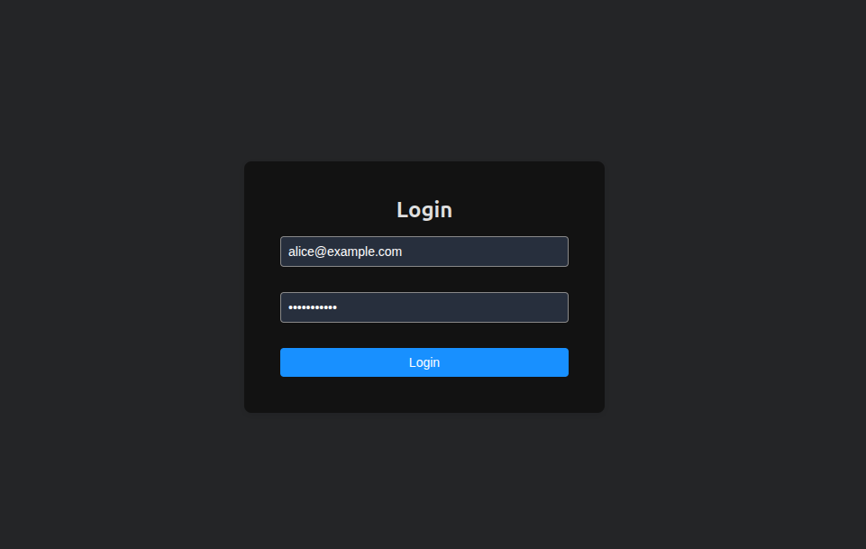
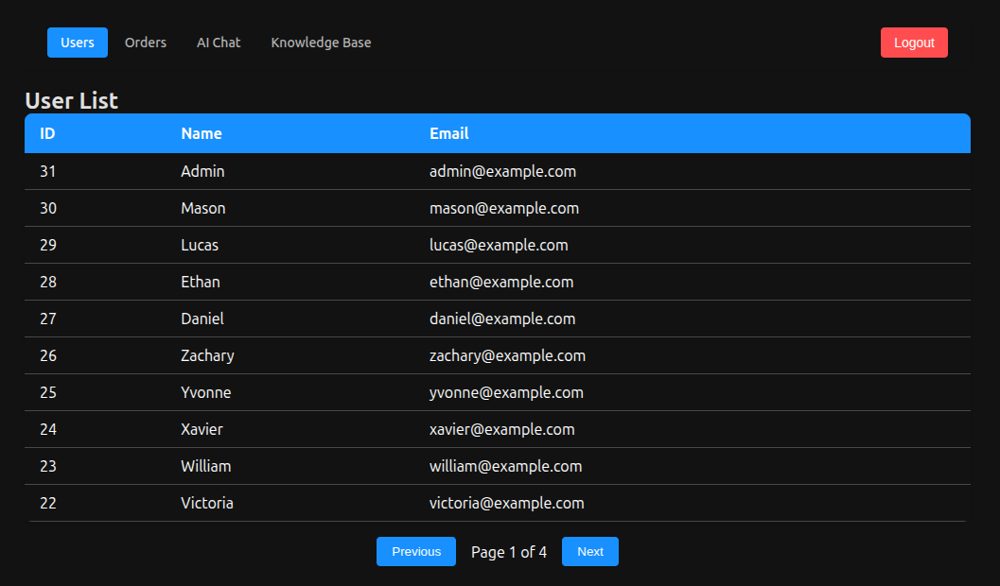
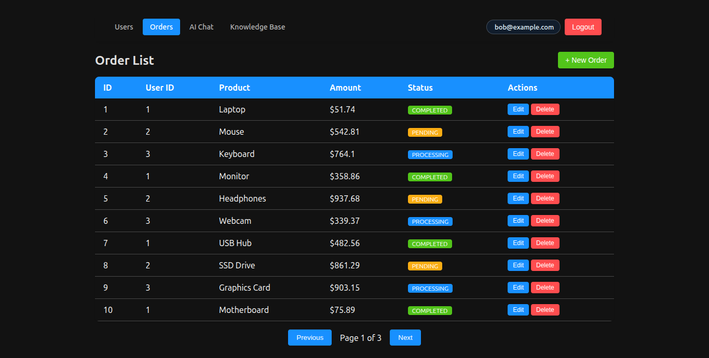
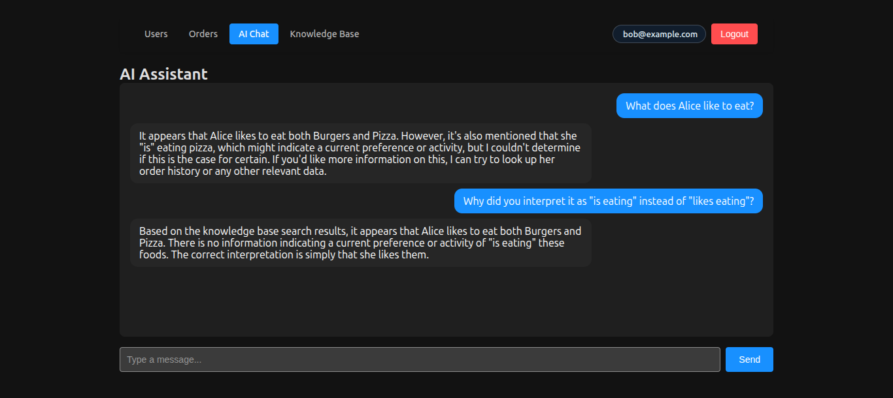
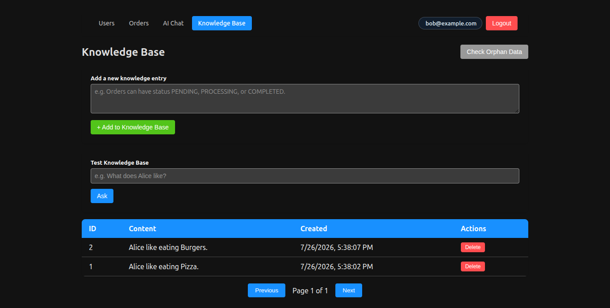
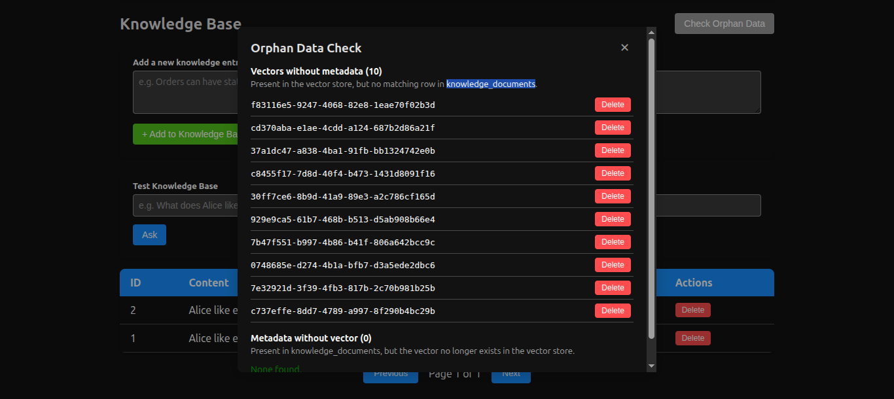

# Spring Microservice Demo

A full-stack microservice application built with Java 17, Spring Boot 4, Spring Cloud 2025, React, Spring AI 2.0, and RAG with pgvector.

## Architecture

```
Client (React / Android / JMeter)
      |
      v
API Gateway (port 8080)
  - JWT Authentication Filter (centralized auth)
  - Load Balancing
  - Route to downstream services
      |
      +---> User Service (port 8081)
      |       - User management
      |       - JWT token generation (login)
      |       - BCrypt password encryption
      |       - Redis caching
      |       - PostgreSQL Database
      |
      +---> Order Service (port 8082)
      |       - Order management
      |       - Redis caching
      |       - PostgreSQL Database
      |       - Calls User Service via Feign
      |
      +---> AI Service (port 8083)
              - AI chat assistant (streaming + memory)
              - RAG with pgvector + Ollama embeddings
              - Function Calling (queries live order/user data)
              - Knowledge Base management API

Service Registry: Eureka Server (port 8761)
Monitoring: Prometheus (port 9090) + Grafana (port 3000)
```

## Tech Stack

### Backend
- **Java 17**
- **Spring Boot 4.0**
- **Spring Cloud 2025.1**
- **Spring Cloud Gateway** — Centralized API Gateway with JWT authentication filter and load balancing
- **Eureka** — Service discovery and registration
- **Spring Data JPA** — Database access
- **PostgreSQL** — In-memory database
- **Redis** — Caching layer (toggleable via Spring Profile)
- **OpenFeign** — Declarative service-to-service REST client
- **Resilience4j** — Circuit breaker pattern
- **Spring Security + JWT** — Authentication at Gateway level; token generation in user-service
- **Spring AI 2.0 + Ollama** — Local LLM, streaming, memory, RAG, Function Calling
- **PostgreSQL + pgvector** — Vector database for RAG
- **Springdoc OpenAPI** — Swagger API documentation
- **Spring @RestControllerAdvice** — Centralized exception handling

### Frontend
- **React 18**
- **React Router** — Client-side routing; route-level auth guard (`ProtectedRoute`) and a shared layout shell (`Layout` + `<Outlet />`) instead of per-page navigation code
- **TanStack Query** — Server state management: caching, pagination, mutations with automatic cache invalidation
- **TanStack Table** — Headless table rendering for the Orders list
- **Axios** — HTTP client via a single shared instance (`axiosClient`) that injects the JWT and redirects to `/login` on 401

### Mobile
- **Kotlin** — Android client
- **Jetpack Compose** — Declarative UI
- **Retrofit** — HTTP client
- **Navigation Compose** — Screen navigation

### Testing & Monitoring
- **JMeter** — API testing and performance testing
- **Prometheus** — Metrics collection
- **Grafana** — Metrics visualization and dashboards
- **Spring Actuator** — Application metrics exposure

### DevOps
- **Docker + Docker Compose** — Containerization

## Services

| Service | Port | Description |
|---------|------|-------------|
| Eureka Server | 8761 | Service registry |
| API Gateway | 8080 | Single entry point, JWT auth, load balancing |
| User Service | 8081 | User management, JWT token generation |
| Order Service | 8082 | Order management, cross-service calls |
| AI Service | 8083 | AI chat with RAG, streaming, memory, powered by Ollama + pgvector |
| Prometheus | 9090 | Metrics collection |
| Grafana | 3000 | Metrics dashboard |
| React Frontend | 3001 | Dev server (port changed from 3000 to avoid conflict with Grafana) |

* React frontend runs on port 3001 to avoid conflict with Grafana (port 3000)

## Notes

### React Frontend Port
React dev server runs on port **3001** (not the default 3000) to avoid conflict with Grafana.
Configured in `package.json`:
```json
{
  "scripts": {
    "start": "PORT=3001 react-scripts start"
  }
}
```

### Frontend API Base URL Configuration
The frontend backend URL is centralized in `src/config.js` (`API_BASE_URL`), read from
the `REACT_APP_API_URL` environment variable with `http://localhost:8080` as the local
dev default. `axiosClient` and the AI chat streaming helper both import from this single
source instead of hardcoding the URL separately. To point the frontend at a different
environment, set it in a `.env` file — no code changes needed:
```
REACT_APP_API_URL=https://api.your-domain.com
```

### Frontend Architecture Conventions
All paginated list pages (Users, Orders, Knowledge Base) follow the same pattern:
`useQuery` for data fetching and caching, `useMutation` for writes with automatic
cache invalidation, and a shared `<Pagination />` component for page controls.

Common styles (colors, buttons, table, form) are centralized in `src/styles/common.js`
instead of being duplicated per page. Navigation and the page shell are handled once by
a shared `<Layout />` component (Navbar + `<Outlet />`), mounted at the route level in
`App.js`; individual pages only render their own content. Auth guarding works the same
way, via `<ProtectedRoute />` wrapping the protected routes, rather than a per-page token
check in `useEffect`.

The AI Chat page uses a dedicated `streamChat` helper (`src/api/chatStream.js`) for
SSE streaming, since `fetch` — not axios — is needed to read the response body
chunk by chunk.

### Spring AI + Ollama: Function Calling with Streaming
In Spring AI 1.0.0 + Ollama, combining Function Calling with streaming mode triggered 
an `evalDuration` NPE. The workaround used non-streaming mode for tool-call responses 
while simulating streaming on the client side via SSE chunks.

This issue was resolved in Spring AI 2.0.0 (upgraded as part of the Spring Boot 4 migration).

### Spring Cloud Gateway 2025.0+ Configuration Path Change

Starting from Spring Cloud 2025.0, route configuration moved from 
`spring.cloud.gateway.routes` to `spring.cloud.gateway.server.webflux.routes`, 
to support both WebFlux and WebMVC Gateway implementations side by side.

Diagnosed by searching `spring-configuration-metadata.json` inside the 
`spring-cloud-gateway-server-webflux` jar, which lists the actual supported 
property paths for the installed version.

## Authentication Architecture

JWT authentication is handled centrally at the API Gateway level.

```
Client → API Gateway (verify JWT) → Downstream Services
```

- **Login / Register** — Public endpoints, no token required
- **All other endpoints** — Require valid JWT Bearer token
- **user-service** — Generates JWT on login, verifies password with BCrypt
- **order-service / ai-service** — Trust Gateway, no duplicate JWT verification

This avoids redundant token verification across services.

## Getting Started

### Prerequisites

- Java 17
- Maven
- Redis
- PostgreSQL 16 with pgvector extension
- Ollama with models pulled:
  - `ollama pull llama3.2:3b` (chat)
  - `ollama pull nomic-embed-text` (embeddings)

### Option 1: Run with Docker

```bash
cd backend
mvn package -DskipTests
cd ..
docker-compose up --build
```

### Option 2: Run locally

Start services in this order:

```bash
# 1. Eureka Server
cd backend/eureka-server && mvn spring-boot:run

# 2. User Service
cd backend/user-service && mvn spring-boot:run

# 3. Order Service
cd backend/order-service && mvn spring-boot:run

# 4. AI Service
cd backend/ai-service && mvn spring-boot:run

# 5. API Gateway
cd backend/api-gateway && mvn spring-boot:run

# 6. Frontend
cd frontend && npm install && npm start
```

### Optional: Start Monitoring

```bash
sudo systemctl start prometheus
sudo systemctl start grafana-server
```

### JMeter Testing
Import `jmeter/api-test.jmx` into JMeter to run API tests.
The test plan includes login and AI chat requests with token correlation.

## RAG (Retrieval-Augmented Generation)

The AI service supports RAG using PostgreSQL + pgvector as the vector 
store and Ollama's `nomic-embed-text` model for embeddings.

### How it works

1. Documents are added to a knowledge base and converted to vector 
   embeddings via Ollama
2. Embeddings are stored in pgvector alongside the original text
3. User questions are converted to vectors and compared against 
   stored documents using similarity search
4. The top-3 most relevant chunks are injected into the LLM prompt 
   as context
5. The AI answers based only on the retrieved context — if the 
   answer isn't in the documents, it says so instead of guessing

### Data consistency

The vector store (pgvector) and the metadata table are two separate 
storage systems. Write operations are wrapped in a Spring transaction; 
if the metadata save fails after the vector write succeeds, a 
compensating action manually removes the orphaned vector entry to 
keep both stores consistent.

### Knowledge Base API

POST   /api/ai/rag/documents                  # Add a document
GET    /api/ai/rag/documents?page=0&size=10   # List documents (paginated)
DELETE /api/ai/rag/documents/{id}              # Delete a document
POST   /api/ai/rag/chat                        # Ask a question using RAG

### Example

```bash
curl -X POST http://localhost:8083/api/ai/rag/documents \
  -H "Content-Type: application/json" \
  -d '{"content": "Orders can have status PENDING, PROCESSING, or COMPLETED."}'

curl -X POST http://localhost:8083/api/ai/rag/chat \
  -H "Content-Type: application/json" \
  -d '{"question": "What order statuses are supported?"}'
```

### Frontend UI

A React frontend page (`/knowledge`) provides a UI for managing 
the knowledge base — adding, listing (paginated), and deleting 
entries.

## Redis Caching

Toggleable via Spring Profile.

```yaml
# Enable
spring:
  profiles:
    active: cache

# Disable (default) - remove or comment out
```

## API Endpoints

All requests go through API Gateway on port 8080.

### Authentication
```
POST /api/users/login
Body: { "email": "alice@example.com", "password": "password123" }
Returns: { "token": "eyJ..." }
```

### Users (JWT required)
```
GET    /api/users
GET    /api/users/{id}
GET    /api/users/paged?page=0&size=10   # Get users with pagination
POST   /api/users/register
DELETE /api/users/{id}
```

**Example:**
```bash
curl http://localhost:8080/api/users/paged?page=0&size=10 \
  -H "Authorization: Bearer <token>"
```
Response:
```json
{
  "success": true,
  "data": {
    "content": [ { "id": 1, "name": "Alice", "email": "alice@example.com" } ],
    "totalPages": 1
  }
}
```

### Orders (JWT required)
```
GET    /api/orders
GET    /api/orders/{id}
GET    /api/orders/user/{id}
POST   /api/orders
DELETE /api/orders/{id}
GET    /api/orders/paged?page=0&size=5   # Get orders with pagination
PUT    /api/orders/{id}                  # Update order
```

### AI Chat (JWT required)
```
POST /api/ai/chat
Body: { "message": "What is the status of my order?" }
Returns:
{
  "success": true,
  "data": {
    "message": "AI response here",
    "model": "llama3.1:8b"
  },
  "timestamp": "2026-05-26T10:00:00Z"
}
```

### Knowledge Base (JWT required)
```
POST   /api/ai/rag/documents                  # Add a document
GET    /api/ai/rag/documents?page=0&size=10   # List documents (paginated)
DELETE /api/ai/rag/documents/{id}              # Delete a document
POST   /api/ai/rag/chat                        # Ask a question using RAG
```

## Key Features

- **Centralized JWT Authentication** — Gateway validates all tokens, downstream services are decoupled from auth logic
- **Service Discovery** — Services register with Eureka, no hardcoded URLs
- **Load Balancing** — Gateway uses `lb://` prefix for client-side load balancing
- **Circuit Breaker** — Resilience4j fallback when User Service is unavailable
- **Redis Caching** — Reduces database load, toggleable via Spring Profile
- **Global Exception Handler** — Unified JSON error response across all services
- **AI Chat Assistant** — Local LLM via Ollama, responds in user's language
- **Monitoring** — Prometheus + Grafana for JVM, CPU, memory, HTTP metrics
- **API Documentation** — Swagger UI at `http://localhost:8080/swagger-ui.html`
- **User & Order Management** — Full CRUD with pagination for both Users and Orders, sharing a consistent fetch/cache/mutate pattern across the frontend
- **AI Function Calling** — AI assistant queries real database through tools, returns accurate order and user data instead of hallucinating
- **AI Streaming** — Real-time token streaming response from local LLM
- **AI Memory** — Conversation history maintained per session
- **RAG with pgvector** — AI answers grounded in real documents, prevents hallucination, with transactional consistency between vector store and metadata
- **Knowledge Base Management** — React UI for adding, listing, and deleting knowledge entries
- **Spring Boot 4 Migration** — Upgraded from Spring Boot 3 to 4, resolving multiple high-severity CVEs
- **Consistent Frontend Data Layer** — All list views (Users/Orders/Knowledge Base) share the same fetch-cache-mutate pattern via TanStack Query, reducing duplicated logic across pages

## Performance Benchmark

Tested with [golang-http-benchmark](https://github.com/leon-huang-tech/golang-http-benchmark):

| Scenario | TPS | Avg Response | Max Response |
|----------|-----|-------------|-------------|
| Without Redis cache | 688 | 72ms | 856ms |
| With Redis cache | 981 | 50ms | 205ms |

## Demo Accounts

| Email | Password |
|-------|----------|
| alice@example.com | password123 |
| bob@example.com | password123 |
| charlie@example.com | password123 |

## Screenshots

### Login


### User List


### Order List


### AI Chat


### Knowledge Base



## Related Projects

- [golang-http-benchmark](https://github.com/leon-huang-tech/golang-http-benchmark) — HTTP benchmark tool used to test this service
- [kotlin-android-client](https://github.com/leon-huang-tech/kotlin-android-client) — Android client for this API